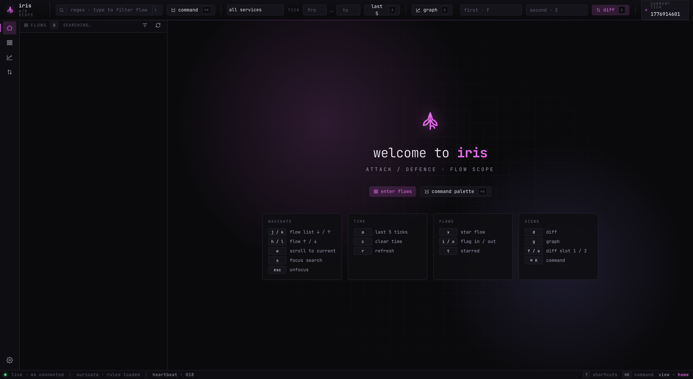
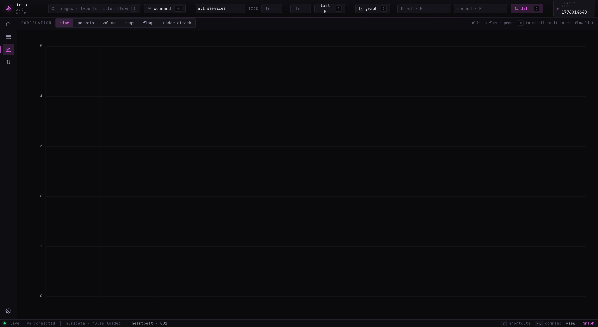
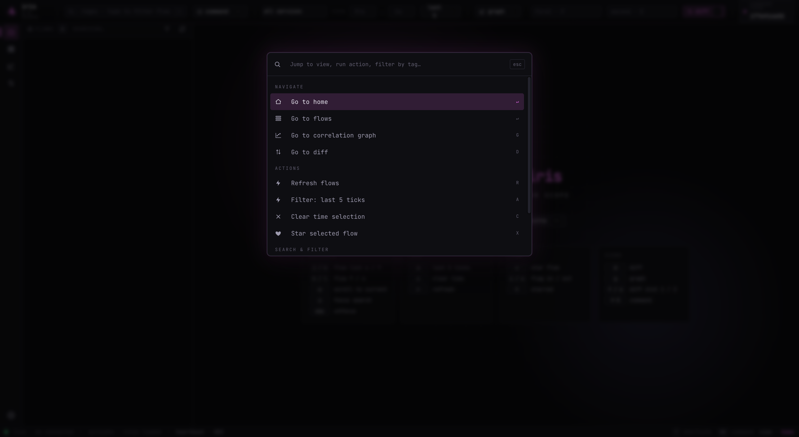

# 🪻 Iris

Iris is a flow analyzer meant for use during Attack / Defence CTF competitions. It allows players to easily find some traffic related to their service and automatically generates python snippets to replicate attacks.

## Origins
Iris is a fork of Tulip, which was developed by Team Europe for use in the first International Cyber Security Challenge. The project is a fork of [flower](https://github.com/secgroup/flower), but it contains quite some changes:
* New front-end (typescript / react / tailwind)
* New ingestor code, based on gopacket
* IPv6 support
* Vastly improved filter and tagging system.
* Deep links for easy collaboration
* Added an http decoding pass for compressed data
* Synchronized with Suricata.
* Flow diffing
* Time and size-based plots for correlation.
* Linking HTTP sessions together based on cookies (Experimental*, disabled by default)
* PCAP-over-IP with BPF filtering support**

\* - to enable, add `-experimental` after `./assembler` in `docker-compose.yml`

\*\* - to enable, configure PCAP-over-IP server (e.g. [pcap-broker](https://github.com/fox-it/pcap-broker) as suggested in [PR 24](https://github.com/OpenAttackDefenseTools/tulip/pull/24)) and set `PCAP_OVER_IP` (and `BPF` if necessary) in `.env`

## Screenshots




## Configuration

The quickest way is the interactive wizard:

```
./iris-setup
```

It is a single stdlib-only Python 3 script (3.8+); nothing to install, works on
any Linux / macOS host. Run it from the repo root. At the end of the session it
writes `.env` and `services/api/configurations.py` and leaves a `.bak` copy of
each file it overwrites, so you can always fall back to the previous state.

### What the wizard asks

The prompts are gated by your earlier answers, so a vulnbox-only install
doesn't get asked about the frontend, and an IDS install doesn't get asked
about NFQUEUE. Full set:

1. **Deployment mode** - one of four profile combinations
   (`all-in-one IDS`, `all-in-one IPS`, `split-iris`, `split-vulnbox`).
   This drives which of the later sections are shown and fills `COMPOSE_PROFILES`.
2. **Traffic source** (core modes only) - pick between rsync into a shared
   directory, PCAP-over-IP streaming, or local capture via `DUMP_PCAPS`. Sets
   `TRAFFIC_DIR_HOST`, `TRAFFIC_DIR_DOCKER`, `PCAP_OVER_IP`, `DUMP_PCAPS*`, and
   an optional `BPF` filter.
3. **Game parameters** - `TICK_START` (ISO-8601), tick length presets
   (60 s / 120 s / 180 s / 300 s / custom), flag regex presets
   (Faust / ENOWARS / ECSC / RuCTF / custom), `VM_IP`, `TEAM_ID`.
4. **Services** - walks you through adding the services you defend; the list
   lands in `services/api/configurations.py` and drives the service dropdown
   in the UI. If a previous list exists (including the legacy `helper='''ip:port name'''`
   format) it's parsed and offered as the default.
5. **Suricata** - `SURICATA_DIR_HOST`, `SURICATA_UPDATE_ENABLE`, `EMIT_SID_TAGS`.
6. **NFQUEUE** (IPS modes only) - `NFQUEUE_NUM`, `NFQUEUE_IFACE`, `NFQUEUE_CHAINS`,
   `NFQUEUE_IPV6`.
7. **Split-mode shipper** (vulnbox mode only) - `VULNBOX_SSH_DEST`,
   `VULNBOX_SSH_KEY`, `SHIP_INTERVAL`.
8. **Flag validator** (core modes only) - none / faust / enowars / eno / itad,
   plus `FLAG_VALIDATOR_TEAM` when a validator is picked.
9. **FlagID scraping** (core modes only) - `FLAGID_SCRAPE`, `FLAGID_ENDPOINT`,
   `FLAGID_SCAN`, `FLAG_LIFETIME`.
10. **Preview** - a coloured unified diff of `.env` and (if relevant)
    `services/api/configurations.py`. Press `y` to write, anything else to bail.

### Flags

```
./iris-setup                 run the wizard (default)
./iris-setup --dry-run       show the diff, skip the write step
./iris-setup --no-color      disable ANSI colour (pipes, CI logs)
./iris-setup --help          full option list
```

### Re-running

The wizard is safe to re-run: it parses the current `.env` and
`services/api/configurations.py` first, then uses those values as the
highlighted default at every prompt. Hit `Enter` at any question to keep
what you already had and only type values for the fields that changed.

### Hand-editing

If you want to skip the wizard, the two files are:

- `.env` (copy from `.env.example` first) for runtime configuration,
- `services/api/configurations.py` for the services list.

You can edit either during the CTF and rebuild just the `api` service:

```
docker compose up --build -d api
```

## Usage

The stack can be started with docker-compose, after creating an `.env` file. See `.env.example` as an example of how to configure your environment.
```
cp .env.example .env
# < Edit the .env file with your favourite text editor >
docker compose up -d --build
```

Iris uses Docker Compose [profiles](https://docs.docker.com/compose/profiles/)
to select which services to run. The defaults in `.env.example`
(`COMPOSE_PROFILES=iris,suricata-ids`) reproduce the classic Iris + offline
Suricata behaviour. See [Deployment modes](#deployment-modes) below for the
IPS and split-host options.

To ingest traffic, it is recommended to create a shared bind mount with the docker-compose. One convenient way to set this up is as follows:
1. On the vulnbox, start a rotating packet sniffer (e.g. tcpdump, suricata, ...)
```bash
tcpdump -i eth0 -G 180 -w "traffic_%H:%M:%S.pcap" port 8080
```
2. Using rsync, copy complete captures to the machine running iris (e.g. to /traffic)
```bash
rsync -avz -e ssh --progress root@10.0.0.2:/pcaps ./pcaps
```
3. Add a bind to the assembler service so it can read /traffic
   > (Just change `TRAFFIC_DIR_HOST` in `.env`)

The ingestor will use inotify to watch for new pcap's and suricata logs. No need to set a chron job.


## Deployment modes

Iris ships four compose profiles that combine into three deployment shapes:

| Profile         | Role                                                                         |
|-----------------|------------------------------------------------------------------------------|
| `iris`          | Core stack: timescale, api, frontend, assembler, enricher, flagids           |
| `suricata-ids`  | Suricata reading offline pcap files (today's default, passive observation)   |
| `suricata-ips`  | Suricata inline via **NFQUEUE** - matched `drop` rules block attacks in-kernel |
| `vulnbox-agent` | rsync shipper that pushes `eve.json` and pcaps to a remote Iris host        |

Pick a recipe by setting `COMPOSE_PROFILES` in `.env` (or overriding at the CLI
with `--profile`).

### 1. All-in-one (IDS - default)

Everything on one host, Suricata reads offline pcaps. This is what you get with
the default `.env.example`.

```env
COMPOSE_PROFILES=iris,suricata-ids
```

```bash
docker compose up -d --build
```

### 2. All-in-one (IPS - inline blocking)

Same host, but Suricata runs inline via NFQUEUE and actually drops matching
traffic. See [Suricata IPS mode](#suricata-ips-mode-nfqueue) for the safety
notes before turning this on.

```env
COMPOSE_PROFILES=iris,suricata-ips
NFQUEUE_IFACE=eth0           # empty = all interfaces
NFQUEUE_CHAINS=INPUT,FORWARD,DOCKER-USER
```

```bash
docker compose up -d --build
```

### 3. Split: Suricata on the vulnbox, Iris on an analysis host

The vulnbox runs Suricata (IDS or IPS) plus a lightweight shipper; the analysis
box runs the full Iris stack and consumes the shipped files. Good for keeping
the vulnbox light under attack.

> **For ICC-style fleets (one analysis box + N vulnboxes, mid-game additions),
> see [PLAYBOOK.md](./PLAYBOOK.md).** The wizard's `--init-analysis` and
> `--add-vulnbox` subcommands automate everything below; the playbook is the
> day-of-CTF runbook.

**On the vulnbox** - `.env` has:

```env
COMPOSE_PROFILES=suricata-ips,vulnbox-agent
VULNBOX_SSH_DEST=iris@10.0.0.5:/srv/iris/traffic
VULNBOX_SSH_KEY=./vulnbox-agent/id_ed25519
SHIP_INTERVAL=30
```

Drop an SSH key at `./vulnbox-agent/id_ed25519` (generated with
`ssh-keygen -t ed25519 -f ./vulnbox-agent/id_ed25519`) and authorize its public
half on the analysis box. Then:

```bash
docker compose up -d --build
```

**On the analysis box** - `.env` has `COMPOSE_PROFILES=iris` and
`TRAFFIC_DIR_HOST` pointing to the rsync landing directory. The enricher reads
`${SURICATA_DIR_HOST}/log/eve.json`, so make sure `VULNBOX_SSH_DEST` on the
vulnbox targets `${SURICATA_DIR_HOST}/log/eve.json` plus pcaps side-by-side.

## Suricata rules

Rules live in two places:

- **Repo-tracked seeds** at `suricata/rules/` - copied into
  `${SURICATA_DIR_HOST}/lib/rules/` on first run. Never overwritten, so you can
  edit freely under `${SURICATA_DIR_HOST}/lib/rules/`.
- **Runtime dir** at `${SURICATA_DIR_HOST}/lib/rules/` - the Suricata container
  reads everything here matching `*.rules` (configured in
  `suricata/etc/suricata.yaml`).

The seed set (`suricata/rules/local.rules`) uses sids in the
`9000000-9000999` range and carries `metadata: tag <name>;` on every rule. Each
metadata tag becomes a filterable Iris tag - both the raw tag (e.g.
`path_traversal`) and a namespaced alias (`rule:path_traversal`).

### Pulling ET-Open

Set `SURICATA_UPDATE_ENABLE=1` in `.env` to run `suricata-update` at container
start. Rules are fetched into the same `${SURICATA_DIR_HOST}/lib/rules/` tree.

### Metadata to Iris tags

The enricher extracts these tags from each Suricata alert:

| Emitted tag          | Source                                                     |
|----------------------|------------------------------------------------------------|
| `suricata`           | Any rule hit                                               |
| `blocked`            | `alert.action == "blocked"` (IPS drop)                     |
| `<metadata-tag>`     | Raw `metadata: tag <name>;` value                          |
| `rule:<metadata-tag>`| Namespaced alias of the metadata tag                       |
| `sid:<N>`            | Per-signature tag; disable with `EMIT_SID_TAGS=0`          |
| `<flowbit>`          | Each `metadata.flowbits` value (when `-flowbits` enabled)  |

`blocked` flows are highlighted in the flow list with a red left border, and
the signature panel in the flow detail view turns red when any of the rule hits
blocked the packet.

> [!NOTE]
>
> After editing Suricata rule metadata (renaming or id change):
>
> 1. Remove old logs: `rm ${SURICATA_DIR_HOST}/log/*` (otherwise old signatures
>    are repopulated from the ratcheted offset).
> 2. Restart the Suricata and enricher containers.
> 3. If you only restarted (not dropped) the database, clean up stale
>    tags/signatures manually.

## Suricata IPS mode (NFQUEUE)

Inline blocking is off by default. Turning it on hooks the vulnbox's
`iptables` with an NFQUEUE jump so Suricata sees (and can `drop`) packets
before they reach your services.

**Safety defaults** - both are on by default, do not disable them lightly:

- `iptables ... -j NFQUEUE --queue-bypass` means if Suricata crashes, packets
  pass freely instead of all getting dropped.
- Suricata's `nfq.fail-open: yes` does the same from the Suricata side.

Together they guarantee that a Suricata failure cannot bring your vulnerable
services down - the trade-off being that during the outage window you get no
IPS protection.

**Caveats**

- Linux only. NFQUEUE is a Linux-kernel facility.
- The container runs with `network_mode: host` and `NET_ADMIN`/`NET_RAW`. This
  means Suricata-IPS is privileged on the vulnbox - do not expose it to
  untrusted images on the same host.
- `NFQUEUE_CHAINS` defaults to `INPUT,FORWARD,DOCKER-USER`. If your vulnerable
  services run on the host network, `INPUT` is the interesting chain. If they
  run behind Docker's bridge, `DOCKER-USER` is where Docker routes
  forwarded-from-outside traffic.
- Seed rules default to `drop` only on high-confidence patterns (traversal,
  RCE, flag egress). Review `suricata/rules/local.rules` before relying on it
  in production - an over-eager rule will drop your own traffic.

**Tearing down the NFQUEUE jump** - `docker compose down` stops the
containers but leaves the iptables jump in place. Run
`sudo bash suricata/iptables-teardown.sh` from the repo root, or reboot.

# Security
Your Iris instance will probably contain sensitive CTF information, like flags stolen from your machines. If you expose it to the internet and other people find it, you risk losing additional flags. It is recommended to host it on an internal network (for instance behind a VPN) or to put Iris behind some form of authentication.

# Contributing
If you have an idea for a new feature, bug fixes, UX improvements, or other contributions, feel free to open a pull request or create an issue!      

# Credits
Tulip (the original project) was written by [@RickdeJager](https://github.com/rickdejager) and [@Bazumo](https://github.com/bazumo), with additional help from [@Sijisu](https://github.com/sijisu). Thanks to our fellow Team Europe players and coaches for testing, feedback and suggestions. Finally, thanks to the team behind [flower](https://github.com/secgroup/flower) for opensourcing their tooling.
